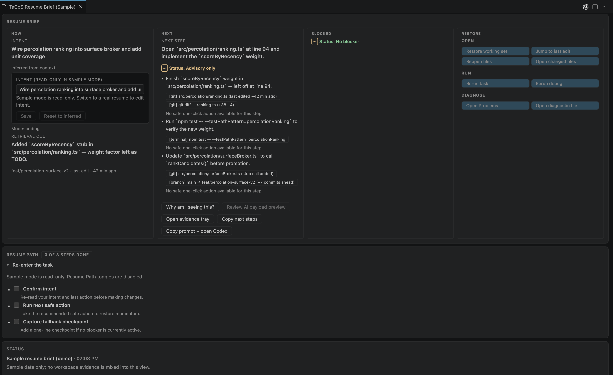

# vscode-tacos

**TaCoS Resume Brief** — a VS Code extension for getting back on track after interruptions.



---

## What it does

TaCoS helps you pick up exactly where you left off. It captures what you were working on before context decays, then surfaces a calm, evidence-backed brief when you return.

Built for engineers who get interrupted constantly:

- SREs and on-call responders
- Staff+ engineers carrying parallel work
- Anyone who loses 10 minutes re-orienting after a context switch

TaCoS is **not** an AI productivity assistant. It's a local-first cognitive recovery tool. The AI parts are optional.

---

## Get started

1. Install the extension.
2. Open a project in VS Code.
3. Run **`TaCoS: Show Resume Brief Now`** to see your brief.
4. Run **`TaCoS: Capture Task Checkpoint`** to save your current context before switching away.

→ [5-minute quickstart](https://github.com/jkordish/vscode-tacos/blob/main/docs/quickstart.md)

---

## Core commands

| Command                            | What it does                                                         |
| ---------------------------------- | -------------------------------------------------------------------- |
| `TaCoS: Show Resume Brief Now`     | Open your resume brief                                               |
| `TaCoS: Capture Task Checkpoint`   | Save current task state (objective, next step, blockers, confidence) |
| `TaCoS: Mark Task Resolved`        | Close the current checkpoint cleanly                                 |
| `TaCoS: Show Cognitive Debrief`    | Review open threads, stale state, and unresolved blockers            |
| `TaCoS: Show Resume Safety Check`  | Post-resume `State / Risk / Verify` quick-check                      |
| `TaCoS: Add Quick Checkpoint Note` | Fast freeform note for the current task                              |
| `TaCoS: List Checkpoint Notes`     | Browse and manage open notes                                         |
| `TaCoS: Run Setup Checklist`       | Guided first-run setup                                               |
| `TaCoS: Set Privacy Preset`        | Choose `Minimal / Balanced / Max context`                            |

---

## How it works

### Task checkpoints

When you capture a checkpoint, TaCoS records:

- what you're trying to accomplish
- files and systems in scope
- assumptions you're treating as true
- blockers in the way
- the single next step
- your confidence level
- when this state goes stale
- the last known safe breakpoint
- what to verify first on resume _(prospective intent — the highest-value recovery cue)_

### Resume brief

When you return, TaCoS answers:

1. What were you doing?
2. What changed since?
3. What do you need to verify next?
4. What's still unresolved?

The panel uses a layered model — **ambient** (status bar), **glanceable** (Resume Brief panel), and **deep** (evidence, timeline, AI payload drill-down).

### Switch detection

TaCoS watches for conservative signals: focus return after idle, workspace root changes, branch changes, and task partition changes. When it detects a likely switch, it offers a one-action prompt: `Capture / Skip / Snooze / Dismiss`. It does not use keystroke logging, biometrics, or black-box scores.

---

## Privacy and safety

- **Local-first.** Nothing leaves your machine without your explicit consent.
- **No hidden telemetry.** Metrics and diagnostics stay local.
- **No cloud backend.** No account, no sync, no backend.
- **AI is optional.** You choose if and when to involve a model.
- **Restricted Mode** fully suppresses risky collection and execution actions.
- **Always-visible provenance badge.** The panel header shows `● Local-only` (green) or `● AI used · <provider>` (amber) on every render — no scrolling required to confirm your data posture.

→ [Privacy and Safety docs](https://github.com/jkordish/vscode-tacos/blob/main/docs/PRIVACY_AND_SAFETY.md)

---

## Settings

| Setting                                     | Default | Description                                       |
| ------------------------------------------- | ------- | ------------------------------------------------- |
| `tacos.taskCheckpoint.enabled`              | `true`  | Enable structured task checkpoints                |
| `tacos.taskCheckpoint.promptOnLikelySwitch` | `true`  | Prompt at conservative switch boundaries          |
| `tacos.resumeSafety.enabled`                | `true`  | Post-resume safety check annunciator              |
| `tacos.resumeSafety.strict`                 | `false` | Warn before first risky action on strong mismatch |
| `tacos.aiIncludeCheckpointNotes`            | `false` | Include checkpoint notes in AI payloads           |
| `tacos.aiIncludeScratchpad`                 | `false` | Include scratchpad in AI payloads                 |
| `tacos.percolationPolicyEnabled`            | `true`  | Dynamic surface arbitration                       |

---

## Docs

- [Quickstart](https://github.com/jkordish/vscode-tacos/blob/main/docs/quickstart.md)
- [Design and implementation](https://github.com/jkordish/vscode-tacos/blob/main/docs/DESIGN_AND_IMPLEMENTATION.md)
- [Privacy and safety](https://github.com/jkordish/vscode-tacos/blob/main/docs/PRIVACY_AND_SAFETY.md)
- [Specs](https://github.com/jkordish/vscode-tacos/blob/main/SPECS.md)
- [Changelog](https://github.com/jkordish/vscode-tacos/blob/main/CHANGELOG.md)

---

## Development

```bash
npm ci
npm run verify:quick       # format + lint + typecheck + unit tests
npm run test:integration   # VS Code integration harness
npm run package:vsix       # build VSIX artifact
```

---

## License

MIT
