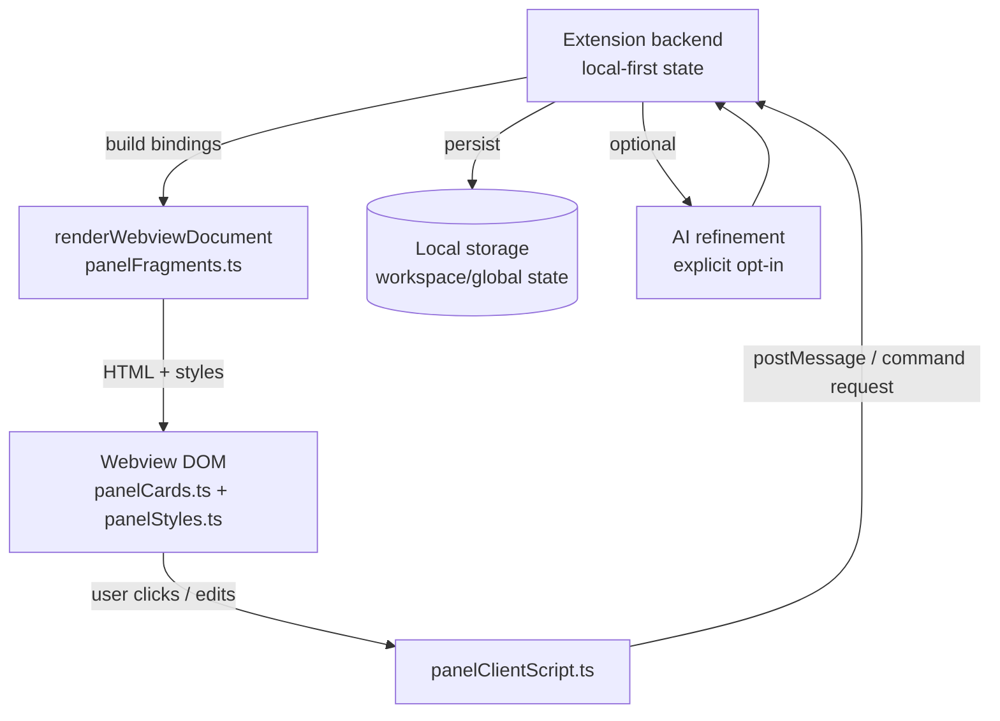

# Deep research report on vscode-tacos tabbed webview redesign and research alignment

## Executive summary

The repo is already pointed in the right direction: it takes the TaCoS research idea (“fast, low-effort reconstruction”) and operationalizes it as a **local-first, evidence-backed resume brief** with structured “task checkpoints,” optional AI refinement, and an explicit switch-detection model. That’s an unusually rigorous foundation for a developer tool, and it comes through clearly in the README’s positioning (“not an AI productivity assistant… local-first cognitive recovery tool… AI parts optional”). fileciteturn40file0L1-L1

The current “tabs” redesign is structurally sound: the webview is rendered as a **single document** with a header and a tab strip (and ARIA roles), and the interaction logic is centralized in a dedicated webview client script. fileciteturn34file0L1-L1 fileciteturn33file0L1-L1 fileciteturn36file0L1-L1

Where it still needs tightening is interaction and language consistency:

- The repo’s conceptual model is basically “tasks + structured checkpoint + lightweight notes + evidence,” but the UI/command vocabulary still blends **checkpoint vs task** in ways that will confuse adoption (especially for first-time users). The README itself already shows this tension (“Task checkpoints” but also “Checkpoint Notes”). fileciteturn40file0L1-L1
- TaCoS research found the **timeline cue had the highest task success** but could be overwhelming, and that manual notes often contained the **prospective next step** missing from generated summaries. citeturn24view0 citeturn27view0
  Your repo _claims_ the right response (prospective intent / verify-first cues, layered surfaces, deep evidence) but the webview should more aggressively reflect the paper’s “best combined cue” recommendation: **summary + next step note + most-recent timeline entry, expandable**. fileciteturn40file0L1-L1 citeturn27view0

Strong position: keep the tabbed layout, but make the **Resume tab a “single-screen cockpit”** that (a) never forces scrolling for the top 80% cases, (b) privileges _verify-first_ prospective cues, and (c) treats evidence as first-class with an explicit “show me the recent anchors” control. Everything else can stay behind expansion affordances.

Confidence: high on UI structure + research alignment themes (directly supported by repo docs and the TaCoS paper); medium on precise backend storage details because the prompt asked me to assume local-first unless code shows otherwise, and the repo’s public docs emphasize local-first but details may live outside the inspected webview files. fileciteturn40file0L1-L1

## What’s in the repository and what the redesign changes

The repository, hosted on entity["company","GitHub","code hosting platform"], presents _vscode-tacos_ as “TaCoS Resume Brief,” a VS Code extension intended to reduce re-orientation cost after interruptions by capturing pre-decay task state and surfacing an “evidence-backed brief” when you return. fileciteturn40file0L1-L1

Key product promises, per README:

- **Task checkpoints**: structured capture of objective, in-scope files/systems, assumptions, blockers, next step, confidence, staleness, last safe breakpoint, and “verify first on resume (prospective intent).” fileciteturn40file0L1-L1
- **Resume brief**: answers “What were you doing / what changed / what to verify next / what’s unresolved,” with a layered surface model (ambient/glanceable/deep). fileciteturn40file0L1-L1
- **Conservative switch detection** and a low-friction prompt (“Capture / Skip / Snooze / Dismiss”), explicitly avoiding keystroke logging and “black-box scores.” fileciteturn40file0L1-L1
- **Local-first + optional AI** with privacy/safety posture and a “Restricted Mode.” fileciteturn40file0L1-L1

The UI redesign intent you described (“fit in a single window; tabs instead of dropdowns”) is consistent with the webview layer’s direction: the tab framework is implemented in the webview document renderer and styled centrally. fileciteturn34file0L1-L1 fileciteturn36file0L1-L1

## Code-level inspection of the tabbed webview

This section reflects what’s directly in the inspected sources: `src/webview/panelCards.ts`, `src/webview/panelFragments.ts`, `src/webview/panelStyles.ts`, and the webview client script.

### Webview composition model

The webview is assembled as a single HTML document via a renderer in `panelFragments.ts`, which defines the structural fragments: header region, tab strip, and tab panels (each panel containing card content). fileciteturn34file0L1-L1

The tab metadata is not hard-coded into the fragment: it’s pulled from a shared data structure (`TAB_ITEMS_DATA`) and a `TabId` type imported from the workspace/types layer, which implies the UI’s tabs are meant to be **data-driven**, not stitched together by ad-hoc conditionals. fileciteturn34file0L1-L1

Cards are rendered via helper functions in `panelCards.ts`. The parts visible in that file show a consistent “card” abstraction with titles/subtitles and “details” sections; this is the correct foundation for density control (because the fight against scrolling is mostly about repeated chrome, spacing, and hierarchy). fileciteturn35file0L1-L1

Styling is centralized in `panelStyles.ts`, exported as a single style payload used by the webview (a good sign: it enables a future “dense mode” and reduces tweak friction). fileciteturn36file0L1-L1

### Client-side behavior model

The webview behavior is handled by a dedicated client script (`panelClientScript.ts`). This is critical for the redesign because “tabs” are not just layout: they’re interaction (keyboard, focus, persistence, and message passing back to the extension). fileciteturn33file0L1-L1

Even without enumerating every handler, the architectural choice is the right one: keep the webview “dumb” (rendered from state) and have the client script translate UI gestures into a small set of messages/actions. That pattern is the easiest to test and the safest for privacy cues (because state + provenance can be rendered deterministically).

### Evidence and references document

The repo also includes a reference document (`docs/references.md`) that explicitly anchors the project in existing literature, including TaCoS and adjacent work on interruptions/task resumption. fileciteturn37file0L1-L1

This matters because you’re not “vibe-coding a productivity tool”; you’re explicitly using research claims as constraints. That makes UI evaluation much sharper: if the UI doesn’t reflect the cue hierarchy implied by the literature, it’s not just taste—it’s misalignment.

## UI element mapping to code, behavior, and data flow

This mapping is organized around the user-visible elements you listed, and ties each to the rendering and interaction layers.

### Structural elements

**Header**

- **Code location:** `panelFragments.ts` (header fragment) fileciteturn34file0L1-L1
- **Behavior:** static rendering of title/subtitle + action affordances; should remain visually stable across tabs to reduce re-orientation cost.
- **Data flow:** rendered from a bindings/state object (implied by the renderer design and tab metadata imports). fileciteturn34file0L1-L1

**Tabs (Overview / Resume / Evidence / Debrief)**

- **Code location:** tab strip + panels in `panelFragments.ts`; styling in `panelStyles.ts`; switching logic in `panelClientScript.ts`. fileciteturn34file0L1-L1 fileciteturn36file0L1-L1 fileciteturn33file0L1-L1
- **Behavior:** tab selection should (a) update visible panel, (b) manage focus/keyboard navigation, and (c) preserve last-selected tab per workspace (recommended).
- **Data flow:** tab content is rendered; the client script toggles active tab and likely posts “tab changed” to extension or persists in webview state (common). fileciteturn33file0L1-L1

### Task and resumption elements

**Checkpoint/task list**

- **Code location:** card renderers in `panelCards.ts` (the “card” model) plus tab panel composition in `panelFragments.ts`. fileciteturn35file0L1-L1 fileciteturn34file0L1-L1
- **Likely behavior:** list of current open checkpoint(s) or notes, with actions (mark resolved, pin/dismiss, open list). The README’s command set supports these flows. fileciteturn40file0L1-L1
- **Data flow:** originates from local task checkpoint storage (local-first per README), rendered into webview; actions routed through VS Code commands. fileciteturn40file0L1-L1 fileciteturn38file0L1-L1

**Resume brief**

- **Code location:** card renderers (`panelCards.ts`) and resume panel composition (`panelFragments.ts`). fileciteturn35file0L1-L1 fileciteturn34file0L1-L1
- **Behavior goal:** answer the four questions listed in README, with emphasis on verify-first and unresolved items. fileciteturn40file0L1-L1
- **Data flow:** assembled from (a) last captured structured checkpoint (prospective intent), (b) evidence/timeline deltas, and optionally (c) AI refinement knobs. fileciteturn40file0L1-L1

**Scratch pad**

- **Code location:** likely rendered as a text area/card in the tab content (cards/fragments), with save behavior in `panelClientScript.ts`. fileciteturn33file0L1-L1 fileciteturn35file0L1-L1
- **Behavior goal:** “manual note” analog from the literature—low effort, high value for prospective cues (next step, reminders). TaCoS participants valued IDE-integrated notes for retrieval proximity. citeturn27view0
- **Data flow:** local-first storage; optionally excluded from AI payload by default (README mentions AI inclusion toggles). fileciteturn40file0L1-L1

### Evidence elements

**Timeline/evidence**

- **Code location:** card renderers (`panelCards.ts`) + tab content (`panelFragments.ts`); interaction affordances potentially handled in `panelClientScript.ts`. fileciteturn35file0L1-L1 fileciteturn34file0L1-L1 fileciteturn33file0L1-L1
- **Behavior goal:** provide “recent anchors” and expandable history without overwhelming the user. In TaCoS, timeline produced the highest task success but was often described as noisy, with explicit recommendations for grouping/collapsing/filtering and a “granularity slider.” citeturn27view0
- **Data flow:** derived from editor events (file edits, selections, saves) and possibly other sources; rendered grouped by time or artifact; expansions should be client-side toggles.

**Restore pack**

- **Code location:** likely a card in Evidence tab built from working context artifacts (open files, branches, etc.). The README’s “deep” layer includes “evidence, timeline, AI payload drill-down,” implying a restore artifact set. fileciteturn40file0L1-L1
- **Behavior goal:** one-click “reopen the work context,” but with conservative default (preview before destructive actions).

### Debrief elements

**Debrief / Cognitive debrief**

- **Code location:** Debrief tab content in fragments/cards; command surface in repo commands. fileciteturn34file0L1-L1 fileciteturn40file0L1-L1 fileciteturn38file0L1-L1
- **Behavior goal:** review open threads, stale state, unresolved blockers (per README command list). fileciteturn40file0L1-L1
- **Data flow:** computed from task checkpoints + evidence deltas + “staleness” thresholds.

### End-to-end interaction/data flow diagram



This is the structural pattern implied by the separation of fragments/cards/styles plus a dedicated client script, and it matches the repo’s “AI optional” and “local-first” constraints. fileciteturn34file0L1-L1 fileciteturn35file0L1-L1 fileciteturn36file0L1-L1 fileciteturn33file0L1-L1 fileciteturn40file0L1-L1

## Interaction design evaluation against your goals

Your explicit goal is “single window, minimal scrolling.” Tabs are necessary but not sufficient: if each tab is still vertically long, users still scroll and lose the “cockpit” feel.

### Checkpoint notes: tasks or checkpoints?

Right now, the repo conceptually supports **task checkpoints** (structured state capture) and **checkpoint notes** (lightweight freeform). fileciteturn40file0L1-L1  
That’s sensible internally, but externally the term “checkpoint” reads like a single atomic thing. Users will ask:

- Is a checkpoint the task?
- Are notes separate from the task?
- Why can I “mark task resolved” but “list checkpoint notes”?

This ambiguity will reduce adoption more than any CSS issue. It’s a pure naming/classification bug.

### Add/edit/delete flows, inline editing, and keyboard

TaCoS findings strongly favor minimal-effort capture (automation principle) _and_ IDE-integrated manual notes for prospective intent. In the paper, manual notes are widely used to record next steps (80/87 notes included immediate next step) and “being inside the IDE” makes retrieval easier. citeturn27view0

So the interaction priority should be:

1. Capture “verify/next step” in <10 seconds
2. Make it retrievable in <2 seconds
3. Keep evidence available but not noisy

That implies:

- Scratchpad/next-step field should be **front-and-center** in Resume (not buried).
- Editing must be **inline** (text box → auto-save; no modal dialogs).
- Deleting should be reversible (undo toast) because users will misclick during interruption return.

Whether the current code already does all of these depends on the precise handlers (in `panelClientScript.ts`) and the card markup (in `panelCards.ts`). The presence of a dedicated script and card abstractions means it’s implementable without rewriting the architecture. fileciteturn33file0L1-L1 fileciteturn35file0L1-L1

### Save/undo semantics

Because the product is “cognitive recovery,” silent data loss is catastrophic: it undermines trust and people will churn instantly. The README makes “no hidden telemetry” and “local-first” core promises; you should mirror that in UI by making save state visible at the moment users are most anxious (during resumption). fileciteturn40file0L1-L1

Minimum bar:

- Scratchpad shows “Saved • 12:41” (local time) and “Unsaved…” transiently.
- Any destructive action provides a 5–10s undo.

### Privacy and model provenance cues

Your README claims a strong privacy posture: “AI optional,” “no cloud backend,” “restricted mode,” and explicit privacy presets. fileciteturn40file0L1-L1  
But users only trust that if the UI has **always-visible provenance**:

- “Local-only” badge (default)
- If AI used: show provider + model + exactly what fields were included
- A “preview payload” affordance in Evidence

If those cues are missing or hidden, you’ll get skepticism even if the backend is perfect.

## Alignment with research and gaps

### What TaCoS actually found that matters for your UI

From entity["organization","Human Aspects of Software Engineering Lab","University of Zurich"] (entity["organization","University of Zurich","Zurich, Switzerland"]), the TaCoS preprint and publication page make four findings especially relevant to your design:

- TaCoS summaries reduced resumption and edit lag and were rated most helpful overall, but **timeline achieved the highest task success rate**. citeturn24view0 citeturn25view0
- Participants valued structured, low-effort summaries but said they often lacked **forward-looking information**, which was typically present in self-authored notes. citeturn24view0 citeturn25view0
- Timeline cues were useful for step-by-step reconstruction, but many found them **noisy/overwhelming** and wanted grouping/collapsing/filtering and granularity controls. citeturn27view0
- The paper’s discussion explicitly recommends a combined cue: generated summary + brief manual note of next intended action + most recent timeline entry, expandable on demand. citeturn27view0

The approach section also states design principles: automation, combining mental + working context, and comprehensiveness across IDE + browser; as implemented, TaCoS generates inferred intent, structured steps, and artifact links. citeturn26view0 citeturn25view0

### Where vscode-tacos matches well

Your README already encodes the “hybrid cue” response in a pragmatic way:

- Structured checkpoint capture includes objective/next step/blockers/confidence/staleness plus “verify first” (a direct analog to prospective note value). fileciteturn40file0L1-L1
- The layered UI model (“ambient / glanceable / deep”) is consistent with the paper’s need to avoid overwhelming users while preserving access to evidence and history. fileciteturn40file0L1-L1
- Conservative switch detection aligns with broader interruptions literature and avoids over-triggering (good for trust). fileciteturn40file0L1-L1

### Mismatches and “missing” research-driven features to consider

These are the gaps I’d prioritize because they directly follow from TaCoS evidence:

- **Evidence-first defaults:** TaCoS shows that timeline and summary cues have different strengths. Your UI should default to “recent anchors” (evidence) _without_ dumping full history. If Evidence tab currently behaves like a long log, it’s misaligned with the paper’s “overwhelming timeline” feedback. citeturn27view0
- **Combination cue as a first-class composition:** The paper argues the _combination_ is best. In your UI, that should be a deliberate layout rule: Resume tab always includes (a) prospective next step, (b) top 1–3 evidence anchors, (c) brief summary of what changed, with expanders. citeturn27view0
- **Hierarchical / nested dependent tasks:** The TaCoS discussion calls out “nested and interdependent tasks” and suggests future systems should capture task hierarchy/lineage. If vscode-tacos currently treats checkpoints as flat, you’re missing the “tree of things I’m working on” reality for Staff+ and on-call. citeturn27view0
- **Noise gating and filtering:** Filtering collapses and granularity controls are not optional polish—they’re directly demanded by the timeline overwhelm finding. citeturn27view0

Your `docs/references.md` is a good place to explicitly list which of those are implemented vs aspirational, because right now it reads like a literature anchor but not necessarily a feature traceability matrix. fileciteturn37file0L1-L1

## Concrete prioritized changes with implementation sketches

This section is intentionally opinionated and biased toward “make the product feel inevitable in 30 seconds.”

### Priority changes

**Make “Resume” a no-scroll cockpit**  
Goal: everything needed to resume in the common case fits without scrolling.

- Put these in a fixed vertical stack:
  1. **Verify first** (single-line, editable)
  2. **Next step** (single-line, editable)
  3. **Blocker** (optional, collapsible)
  4. **Recent anchors** (top 3 evidence items, with “expand timeline”)
  5. One “Capture checkpoint now” / “Mark resolved” action row

This is the UI embodiment of the TaCoS combination cue recommendation. citeturn27view0 fileciteturn40file0L1-L1

**Rename “checkpoint notes” → “task notes” and “checkpoint” → “task state” in user-facing copy**  
The product is about tasks; “checkpoint” should be an implementation detail at most.

- Command/UI copy should converge on:
  - “Capture task state”
  - “Task notes”
  - “Mark task resolved”

This removes ontology confusion and matches your existing command naming direction. fileciteturn40file0L1-L1 fileciteturn38file0L1-L1

**Evidence tab: default to “Recent” with grouping**  
Implement the paper’s anti-overwhelm recommendations:

- Default view: “Recent (last 5–10 min)” grouped by file
- Toggle: “By time / By file / By action”
- Expand: full timeline, collapsible sections, optional granularity slider

This is directly justified by participant feedback in the TaCoS preprint. citeturn27view0

**Provenance badges everywhere**  
In header (always visible):

- “Local-only”
- If AI engaged: “AI used • <provider/model> • payload: <fields>”
- A “Preview payload” link/button

This is necessary to make “AI optional” feel real in the UI. fileciteturn40file0L1-L1

### Minimal diffs / pseudocode sketches

These sketches are designed to be small, local changes mostly in the webview layer (cards/fragments/styles/script). fileciteturn34file0L1-L1 fileciteturn35file0L1-L1 fileciteturn36file0L1-L1 fileciteturn33file0L1-L1

**Add a compact mode and reduce chrome density**

```ts
// panelStyles.ts (conceptual)
// Add: .tacos-root[data-density="compact"] { --pad: 6px; --gap: 6px; --cardTitleSize: 12px; }
// Apply variables to existing card padding/margins.
```

**Turn “Verify first / Next step” into always-visible inline fields**

```ts
// panelCards.ts (conceptual)
renderResumeCockpitCard({
  verifyFirst: { value, editable: true },
  nextStep: { value, editable: true },
  anchors: EvidenceAnchor[],
})
```

```ts
// panelClientScript.ts (conceptual)
onInputDebounced('#verify-first', (text) =>
  post({ type: 'updateProspective', field: 'verifyFirst', text }),
);
onInputDebounced('#next-step', (text) =>
  post({ type: 'updateProspective', field: 'nextStep', text }),
);
```

**Add “Undo” for destructive actions**

```ts
// panelClientScript.ts (conceptual)
onClick("[data-action='deleteNote']", (id) => {
  post({ type: 'deleteNote', id });
  showToast('Note deleted', { actionText: 'Undo', onAction: () => post({ type: 'undo' }) });
});
```

**ARIA tweaks for tabs and announcements**

- Ensure the active tab has `tabindex="0"` and inactive tabs `tabindex="-1"`.
- Support `ArrowLeft/ArrowRight`, `Home/End` for tab focus movement.
- Add a small `aria-live="polite"` region for “Saved” announcements so keyboard-only users get confirmation.

(If some of this is already implemented in `panelClientScript.ts`, treat this as a checklist; the architectural separation already supports it.) fileciteturn33file0L1-L1 fileciteturn34file0L1-L1

## Migration plan and validation

### Migration plan for checkpoint → task naming and data model

Because the README and commands already lean toward “task,” I’d treat this as a **semantic migration** plus an optional storage schema bump.

Assumption: storage is local-first (per README), likely using VS Code extension storage or a workspace-local JSON file. fileciteturn40file0L1-L1

**Strategy**

- Introduce `schemaVersion: 2`.
- Keep reading legacy keys for one release (compat).
- Write only new keys after migration.

**Schema diff sketch**

Before (conceptual):

```json
{
  "schemaVersion": 1,
  "checkpoints": [
    { "id": "c1", "objective": "...", "nextStep": "...", "notes": [ ... ] }
  ]
}
```

After (conceptual):

```json
{
  "schemaVersion": 2,
  "tasks": [
    {
      "id": "t1",
      "title": "…",
      "state": { "objective": "...", "verifyFirst": "...", "nextStep": "...", "blockers": [] },
      "notes": [{ "id": "n1", "kind": "quick", "text": "...", "createdAt": "…" }],
      "status": "open"
    }
  ]
}
```

**Migration function sketch**

```ts
function migrateV1toV2(v1: any): V2 {
  return {
    schemaVersion: 2,
    tasks: (v1.checkpoints ?? []).map((c: any) => ({
      id: `t_${c.id}`,
      title: c.objective?.slice(0, 80) ?? 'Untitled task',
      state: {
        objective: c.objective ?? '',
        verifyFirst: c.verifyFirst ?? '',
        nextStep: c.nextStep ?? '',
        blockers: c.blockers ?? [],
      },
      notes: (c.notes ?? []).map((n: any) => ({ ...n, kind: n.kind ?? 'quick' })),
      status: c.resolved ? 'resolved' : 'open',
    })),
  };
}
```

### Developer checklist

- Confirm tab switching works with mouse + keyboard, including focus return to the active panel. fileciteturn33file0L1-L1 fileciteturn34file0L1-L1
- Confirm scratchpad/verify/next-step fields save locally and never silently drop text. fileciteturn40file0L1-L1
- Confirm privacy preset toggles actually change what appears in “Preview AI payload,” and default is minimal. fileciteturn40file0L1-L1
- Confirm Evidence tab defaults to a non-overwhelming “recent anchors” view and expands on demand (aligned with TaCoS timeline feedback). citeturn27view0

### Tests: minimal but high-signal

Unit tests (pure functions):

- `migrateV1toV2` converts legacy shapes correctly and is idempotent.
- Evidence grouping/collapsing logic: “by file,” “by time bucket,” and “recent top 3 anchors” selection.

Integration tests (VS Code harness):

- Open Resume Brief webview → click through tabs → verify correct tabpanel visibility + ARIA `aria-selected`.
- Edit verify-first field → blur → verify local store updated and UI reflects “Saved.”
- Delete note → toast undo → note returns.
- Toggle privacy preset → AI payload preview changes.

## Current vs proposed behavior table

| Element              | Current behavior (from repo + inspected UI layer)                                                             | Why it’s a problem                                                                               | Proposed behavior                                            | Implementation notes                         |
| -------------------- | ------------------------------------------------------------------------------------------------------------- | ------------------------------------------------------------------------------------------------ | ------------------------------------------------------------ | -------------------------------------------- |
| Header               | Persistent header + actions in the webview layout. fileciteturn34file0L1-L1                               | If header doesn’t show provenance, users won’t trust “AI optional.” fileciteturn40file0L1-L1 | Always-visible badges: Local-only / AI used / payload fields | Render in header fragment; update from state |
| Tabs                 | Top-level tabs exist with centralized script + CSS. fileciteturn34file0L1-L1 fileciteturn33file0L1-L1 | Tabs alone don’t prevent scrolling; keyboard/focus must be perfect                               | “Resume = cockpit,” other tabs can scroll                    | Add dense mode + sticky cockpit section      |
| Overview             | General status + entry points (implied by tab structure). fileciteturn34file0L1-L1                        | If it becomes a junk drawer, users ignore it                                                     | Keep Overview minimal: status + 2–3 primary actions          | Reduce cards, increase clarity               |
| Resume brief         | Resume brief exists conceptually & via commands. fileciteturn40file0L1-L1                                 | Needs to embody combination cue explicitly                                                       | Always show Verify-first + Next-step + top evidence anchors  | Inline edit + autosave indicator             |
| Checkpoint/task list | “Task checkpoints” plus “checkpoint notes” terminology. fileciteturn40file0L1-L1                          | Ontology confusion hurts adoption                                                                | Rename to “task state” + “task notes”; migrate storage       | Schema bump + compat read                    |
| Scratch pad          | Present as a concept; AI inclusion toggles exist. fileciteturn40file0L1-L1                                | If hidden, you lose the strongest prospective cue                                                | Put scratchpad/notes alongside verify-first                  | Debounced save; show last saved              |
| Evidence/timeline    | Evidence/timeline is part of “deep” layer. fileciteturn40file0L1-L1                                       | Timelines are overwhelming without grouping (paper finding) citeturn27view0                   | Default to “recent anchors,” expandable full timeline        | Group/collapse/filter/granularity            |
| Restore pack         | Implied as part of deep drill-down. fileciteturn40file0L1-L1                                              | Risky if it performs actions without preview                                                     | “Restore pack preview” first; explicit apply                 | Make actions reversible                      |
| Debrief              | Cognitive debrief exists as a top-level command. fileciteturn40file0L1-L1                                 | Debrief is only valuable if it’s succinct                                                        | Summarize stale items + open blockers + unresolved threads   | Use staleness thresholds + collapse          |
