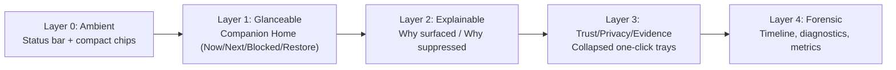
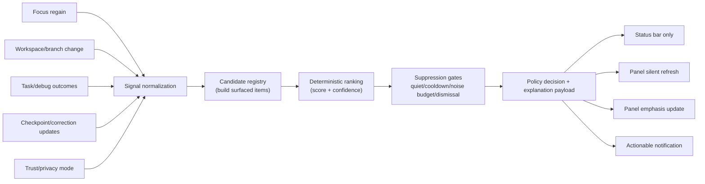
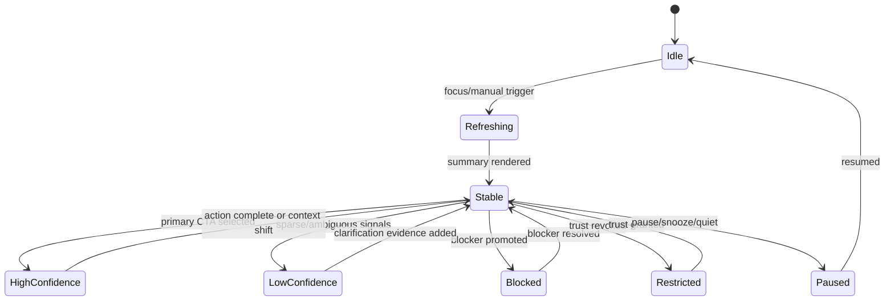
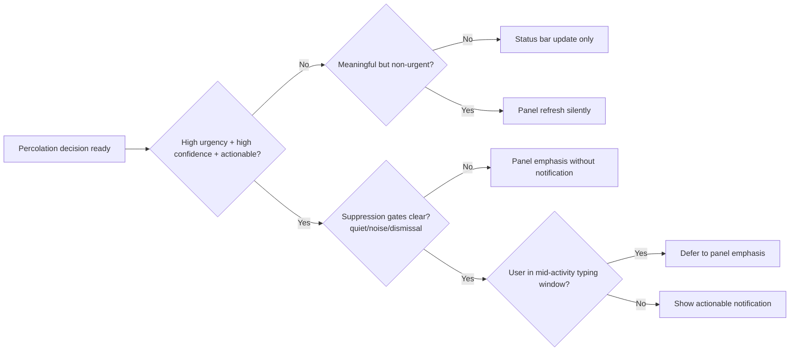

# Dynamic Percolation Mockups (`v0.8.0+`)

Status: Draft visual companion for `docs/ux/dynamic-percolation-v0.8.0-spec.md`

## Current vs Proposed

| Area | Current (`v0.7.0`) | Proposed (`v0.8.0`) |
| --- | --- | --- |
| Ranking scope | Nudge-local plus card-level conditions | Single policy engine ranks all surfaced candidates |
| Explainability | Trust cue + nudge explanation split | Unified "why surfaced / why suppressed" trace |
| Surface arbitration | Mostly `uiSurface` + focus context | Deterministic statusbar/panel/notification policy |
| Layout behavior | Stable card stack with collapsed sections | Same stable stack, but policy-driven emphasis and defaults |
| Restricted mode clarity | Disabled actions + messaging | Same safety, plus explicit policy suppression reasons |

## Information Architecture Diagram



## Signal -> Policy -> Surface Flow



## Event-State Model



## Default Panel Wireframe (Prioritized)

```text
+--------------------------------------------------------------+
| Companion Home                                                |
| ------------------------------------------------------------ |
| NOW:   Stabilize parser fix on branch feature/parser         |
|        [Intent source: inferred] [Mode: coding]             |
|        Last action: Edited src/parser.ts:214 [Open]         |
|                                                              |
| NEXT:  Re-run focused parser test                            |
|        [Primary CTA] Run parser test                         |
|        [Why this next step?]                                 |
|        1) Re-run parser test [evidence badge]               |
|        2) Patch failing branch case [evidence badge]        |
|        3) Capture checkpoint note [advisory]                |
|                                                              |
| BLOCKED: Test failure in parser suite                        |
|          [Primary unblock action] Open failing test          |
|                                                              |
| RESTORE: [Reopen files] [Jump to last edit] [Open Problems] |
|          [Why unavailable?]                                  |
+--------------------------------------------------------------+
| Resume Path (3-step checklist)                               |
+--------------------------------------------------------------+
| Status                                                        |
+--------------------------------------------------------------+
| More Context (collapsed)                                      |
|   - Trust Center                                              |
|   - Session Recap                                             |
|   - Changes Since Last Time                                   |
|   - Companion Nudge                                           |
|   - Timeline                                                  |
|   - Evidence                                                  |
|   - Details                                                   |
+--------------------------------------------------------------+
```

## Trust / Privacy / Evidence Quick Drill-Down

```text
[Trust Chip: Based on 6 files • 3 runs • branch feature/parser]
[Privacy Chip: Local-only + redacted persistence]
[Mode Chip: Active]

Click Trust Chip ->

+--------------------------------------------------------------+
| Why am I seeing this?                                         |
| 1. Branch switched from main -> feature/parser               |
| 2. Recent failing test command detected                       |
| 3. High-confidence file evidence in src/parser.ts             |
|                                                              |
| What TaCoS used                                                |
| - file: src/parser.ts                                         |
| - terminal: npm test -- parser                                |
| - task: test suite run                                        |
|                                                              |
| Privacy posture                                                 |
| - Stored locally: redacted activity + summary cache           |
| - Sent to AI: none (local mode)                               |
| - Restricted mode: off                                         |
|                                                              |
| [Open Privacy & Safety] [Review AI payload preview]           |
+--------------------------------------------------------------+
```

## Notification vs Statusbar Decision Flow



## Restricted Mode Rendering Example

```text
+--------------------------------------------------------------+
| Companion Home                                                |
| NOW: Limited context in Restricted Mode                       |
| NEXT: Safe local action available                             |
| [Open last edited file]                                       |
|                                                              |
| BLOCKED: Execution actions restricted                         |
| [Rerun task] (disabled)                                       |
| Reason: Trust this workspace to enable task/debug execution.  |
|                                                              |
| TRUST CENTER                                                   |
| Mode: restricted                                               |
| Collection changes: git + terminal execution signals disabled |
| AI refinement: disabled                                        |
| [Learn more]                                                   |
+--------------------------------------------------------------+
```

## Stable Emphasis Tokens (No Layout Thrash)

```text
Token examples applied in-place:
- [PRIMARY] one CTA in Next or Blocked section
- [ADVISORY] low-confidence or non-actionable cue
- [ELEVATED CHIP] trust/privacy/restricted chip emphasis
- [SUPPRESSED] badge with quick reason (quiet, cooldown, dismissal)

Rule:
- never move section order based on score
- only change badge/weight/action availability and card accent
```
